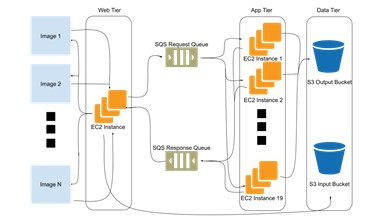
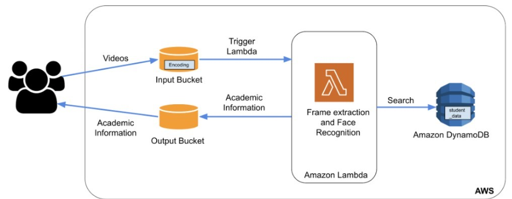
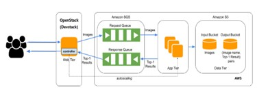

# Image-Recognition-as-a-Service
2.1	Phase 1 
 
Figure 1: High-level overview of the Phase 1 architecture 
Our design hosts a Flask web server which is hosted on an Elastic Compute 2 (EC2) [6] instance in the web tier. Users submit repeated requests to the server, which routes them to the AWS Simple Queueing Service (SQS) [7] request queue, which is a first-in-first-out messaging queue service of AWS. According to the quantity of requests (images) in the SQS request queue, the web server in the web tier scales the app tier in and out by either generating more EC2 instances or terminating them. Scaling out and scaling in happens at the web tier and app tier respectively. For scaling purposes, we implemented a greedy approach. The approach was to create an app-tier EC2 instance for every 4 user requests in the SQS request queue. We set the maximum number of app instances that can be created to 19, by setting the number of worker nodes from 1 to 19. So, the maximum number of instances you can run at once is 20 (1 web-tier instance and 19 app-tier instances). The capping of number of EC2 instances to 20 was based on the maximum workload expectation for the service in the AWS free tier account. The app tier EC2 instances swiftly consume the user image from the request queue and perform image recognition. The SQS response queue is used to send the key value pairs of the image name as key and the object recognised as value, back to the web server in the web tier where the recognition result is rendered. For persistence, the outcomes and original photos are kept in two different AWS Simple Storage Service (S3) [8] Input and Output buckets.

2.2	Phase 2 
 
Figure 2: High-level overview of the Phase 2 architecture 
This phase of the project utilizes the PaaS resources from AWS to create a smart classroom assistant for educators. The application is a serverless cloud application that performs face recognition on the videos collected from the user’s classroom by querying a DynamoDB (NoSQL) database with the recognized students, to fetch their relevant academic information. Figure 2 shown above depicts the architecture of this application. The videos from the user’s classroom are fetched using a Python Flask web server. The webserver pushes the fetched videos into an S3 input bucket. The pushing of the videos into the S3 input bucket generates an event with the video address as an event metadata. This in turn triggers the AWS Lambda function that fetches the video file, extracts the first frame from the video and performs face recognition on the first frame. The labels generated by the face recognition pipeline are the names of the students recognised in the video. These labels are used to fetch the respective student’s academic information from a DynamoDB (NoSQL) Table database and pushed into an S3 output bucket in the form of a csv file. This information in the S3 output bucket is then consumed by the user which are the educators using this service. When the function is called for the first time, AWS Lambda creates an instance of it and executes its handler method to handle the event. When the function responds, it remains active while it awaits further events to handle. When the function is called again while the first event is still being handled, Lambda creates a new instance and handles both events at once. Lambda routes new events to available instances as they arrive and generates additional instances as necessary. Lambda disables idle instances when the number of requests declines to free up scalability capacity for other tasks. 

2.3	Phase 3 
 
Figure 3: High-level overview of the Phase 3 architecture 
In the final phase, as mentioned in Figure 3 we restructured the architecture of the  application by migrating the web-tier instance from a public cloud to a private cloud using an OpenStack Nova instance. The private cloud infrastructure was developed by utilizing the IaaS resources from OpenStack. OpenStack is a free, open standard cloud computing platform. It is mostly used as IaaS in both public and private clouds where users can access virtual servers and other resources. The idea behind migrating to a hybrid cloud infrastructure was to leverage advantages of both public and private cloud. Making the application more secure by deploying the web tier onto the OpenStack private cloud and more scalable by deploying the app tier onto the AWS public cloud. 
